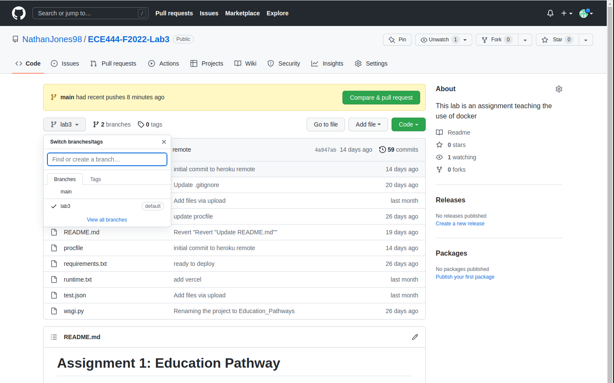
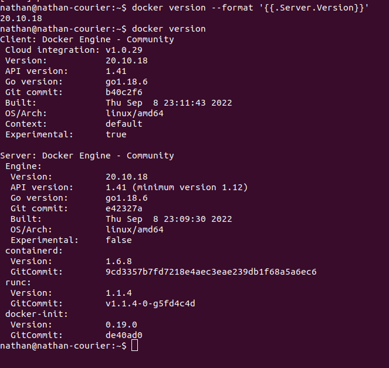

# Lab3: Education Pathway - Docker
Nathan Jones

This repository hosta copy of the source code for Education Pathway project. You can view the original repository [here](https://assignment-1-starter-template.herokuapp.com/). We are using this repo as a starting point for assignment 3.

# Activity 1

# Activity 2

# Activity 1

# Activity 1